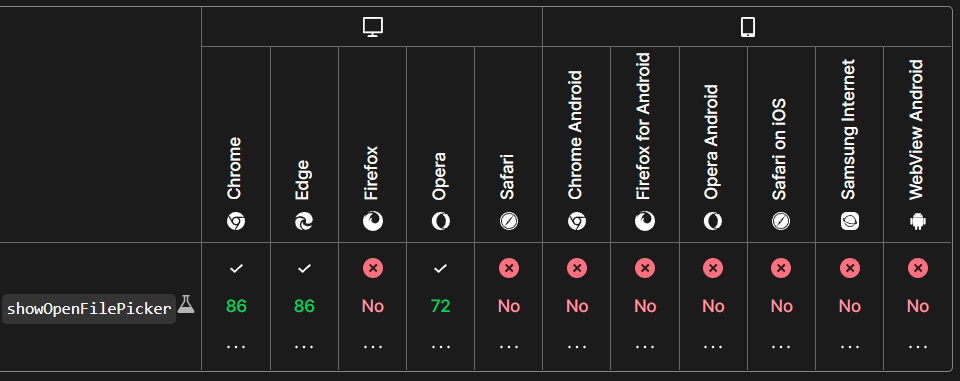

# browser-file-system-access-helper

### What is the File System Access API?

The File System Access API (formerly known as Native File System API and prior to that it was called Writeable Files API) enables developers to build powerful web apps that interact with files on the user's local device, such as IDEs, photo and video editors, text editors, and more. After a user grants a web app access, this API allows them to read or save changes directly to files and folders on the user's device. Beyond reading and writing files, the File System Access API provides the ability to open a directory and enumerate its contents.(<https://web.dev/file-system-access/>)

[check out my other project using it to build a web audio player](https://github.com/paakofiaidoo/juki-audio-player)

Prerequisites

- node & npm
- Frontend Code ( 😊since this works with the browser api )

***!! caution : currently tested on only pure vanilla and svelte. In react place it in the useEffect !!***

To install package

    npm install browser-file-system-access-helper

Import functions
        import { hasFileSystemAccess, getFile, createFile } from "browser-file-system-access-helper";

## To check if browser is compatible

 `hasFileSystemAccess` : returns the boolean value if the browser is compatible with the api

        if (hasFileSystemAccess()) {
                // put all code here
        }
        // true : browser is compatible
        // false : browser is not compatible

## Read a file from the local file system

 `getFile(options)` : returns selected file asynchronously

        let file = await getFile()
        // or
        getFile().then((file)=>{
            console.log(file.name, "file")
        })

        /* the response for file is is an object with 
        {
            // data
            kind: "file" 
            lastModified: 1661213059235
            lastModifiedDate: Tue Aug 23 2022 00:04:19 GMT+0000 (Greenwich Mean Time) {}
            name: "README.md"
            size: 2988
        }
        */

### Read content of the file

    const contents = await file.text()
    textArea.value = contents;

    file.arrayBuffer(), //returns array buffer of file content asynchronously
        
    file.stream (), //returns steam of file content asynchronously

### Modify to file

Just pass in the data (no options)

    await file.write(data);

Writes the data to the stream from the determined position

    await file.write({ type: "write", position, data });

Updates the current file cursor offset to the position specified

    await file.seek(position);

Resizes the file to be size bytes long

    await file.truncate(size); 

<!-- ## Create new file

`createFile(options)` : create a new file into file system -->
